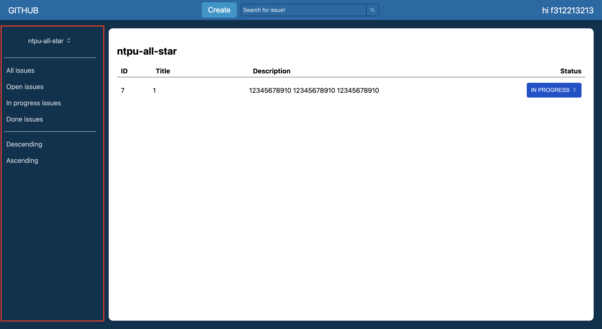
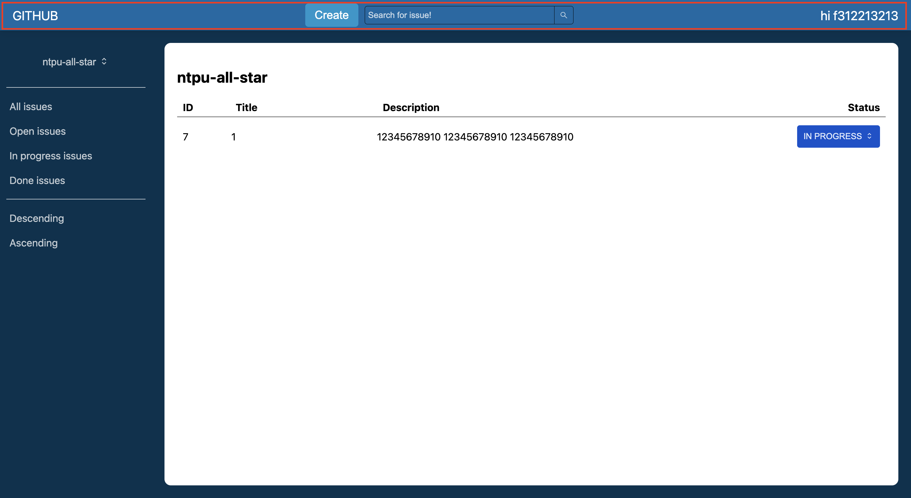
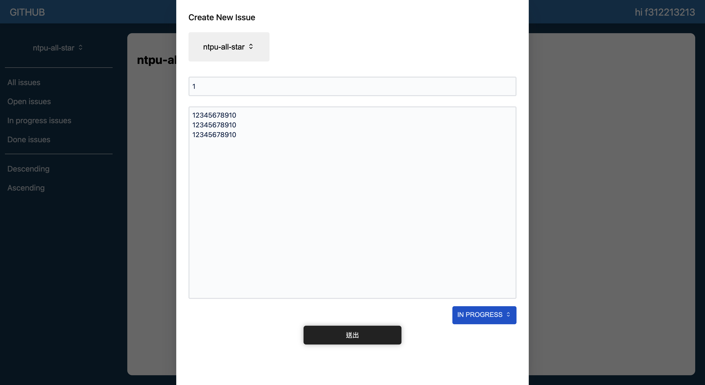
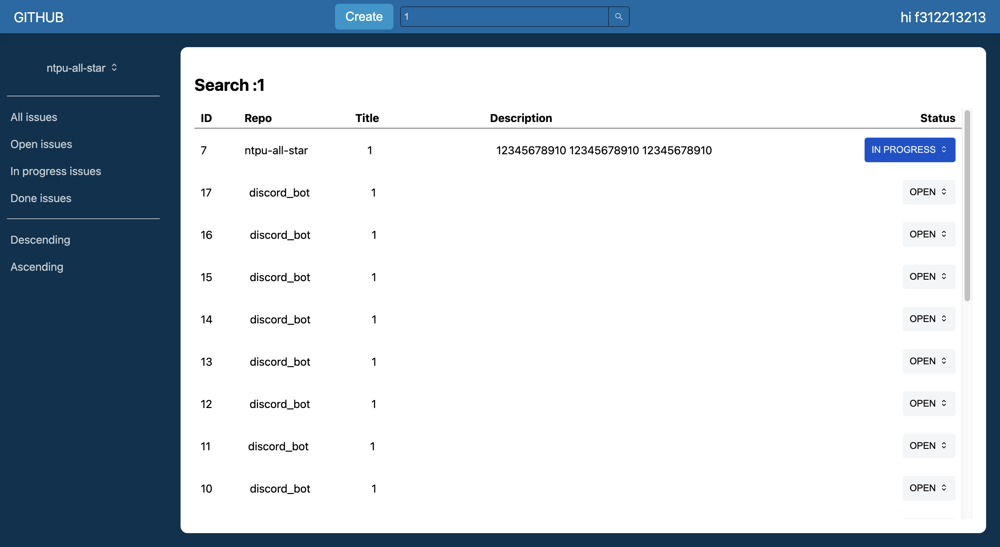
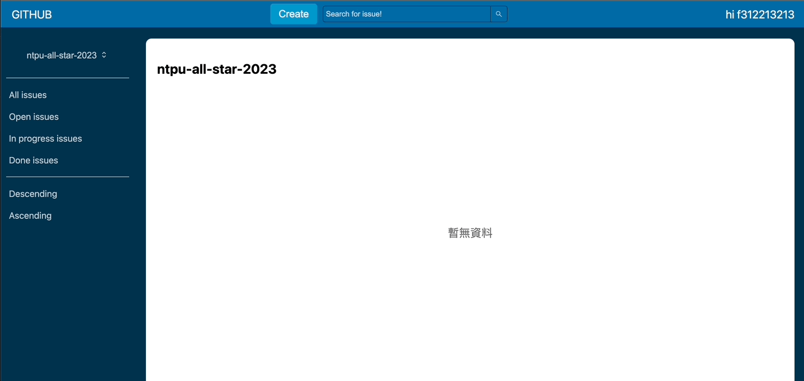
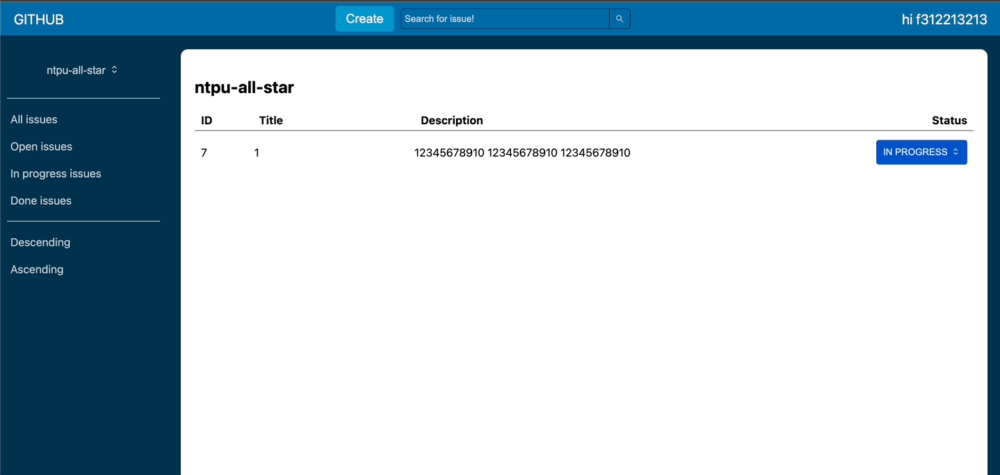
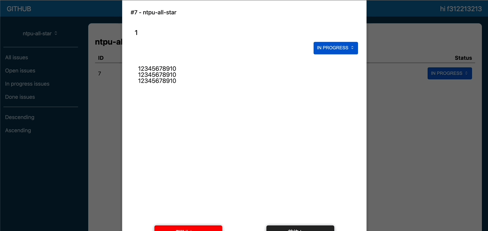

# Dcard 2023 Frontend Intern Homework
This project is a simplified Jira-style web app designed to apply for Dcard's 2023 web frontend intern position. 
The app mimics Dcard's design and allows users to manage tasks with three statuses: open, in progress, and done. 
Users can search tasks based on their status and update or create tasks.

## Requirement

View the project [requirement](https://drive.google.com/file/d/1ZlwuUafAQUKBEA_ZK6ShM5F4xLTkV_4X/view) here.

## How to run this project
### Local
1. Clone the project from GitHub
2. Install the dependencies via `yarn`
3. Register an OAuth app on GitHub, and paste your client id , client secret in .env file.
4. Run in dev mode by entering `yarn dev`, or run in production mode by entering 
```
yarn build
yarn start
```

### Online
Visit the [website](https://dcard-frontend-intern-2023.chiendavid.com/) and log inwith your GitHub account.

## Project Architecture
### Packages
This project uses three main packages:
- **Next**.js: for building react app
- **Redux**: for managing data and state
- **Styled Component**: for styling the website

### Global Components
#### Sidebar
The sidebar appears on every page.



It is used to select the project you are looking for and choose the filter or the order in which your tasks display.

#### Header
The header also appears on every page.



Clicking the create button in the middle opens a form dialog where you can select the project you want to add the task to and its title, body, and initial status.



The search section can be used to enter a keyword to search for a specific task.


### Page
#### / - Display search result

On this page, you can see the result of searching for a task by passing a keyword in the navbar.



#### /browse/[ProjectOwner]/[projectName] - Display project issues

After using the select component in the sidebar, you will be navigated to this page.



Here, you can see the tasks belonging to the selected project in a table. 
Each row in this table represents a link that leads you to a "single task page" (which is actually a dialog).

#### /browse/[ProjectOwner]/[projectName]/[issueNumber] - Display single issue

If you click the link mentioned above, you will see the task details in a dialog.



If you navigate to this page directly (like by typing the address in the address bar), you will see the task details in a full page view.

Both views allow you to edit the task by clicking on the text of the title and body or selecting an updated status using the select component.



You can delete the task by clicking the red button, and you can go to the task page on GitHub by clicking the black button
